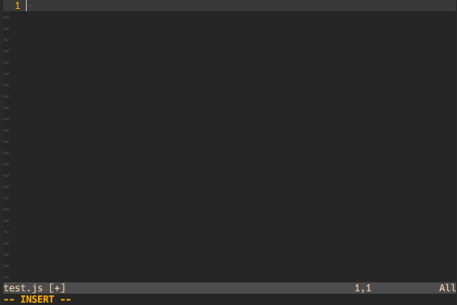

# vim-tagged-template

*NOTE*: This plugin is a fork of
[vim-js-pretty-template](https://github.com/Quramy/vim-js-pretty-template).
I began this fork as an attempt to patch `vim-js-pretty-template` with new
features, but before I got very far I had already redesigned the API
substantially and decided that this should live as its own plugin until such
time as it can be upstreamed.

This plugin lets you configure tags for JavaScript/TypeScript
[Template Strings (aka Template Literals)](http://tc39wiki.calculist.org/es6/template-strings/)
with special highlighting for their contents. For example, you may want to
highlight the contents of a template string tagged with `html` as actual HTML.

Here is a short demo of the syntax highlighting that this plugin enables:



## How to install

You can use your Vim plugin manager of choice to install the plugin. For
example, with vim-plug you would add this to your `.vimrc`:

```vim
Plug 'cdata/vim-tagged-template'
```

## Usage

In order to map template tags to file syntaxes, you need to set the global
`g:taggedtemplate#tagSyntaxMap`. Here is an example that configures syntax
highlighting for HTML, CSS and Markdown:

```vim
" NOTE: Tag on the left, filetype on the right
let g:taggedtemplate#tagSyntaxMap = {
  \ "html": "html",
  \ "md":   "markdown",
  \ "css":  "css" }
```

Then, you need to configure it to apply for the appropriate filetypes. Here
is an example to configure it to apply to JavaScript and TypeScript files:

```vim
autocmd FileType javascript,typescript : call taggedtemplate#applySyntaxMap()
```

## License
This plugin is released under the MIT license, see `LICENSE.txt`.

